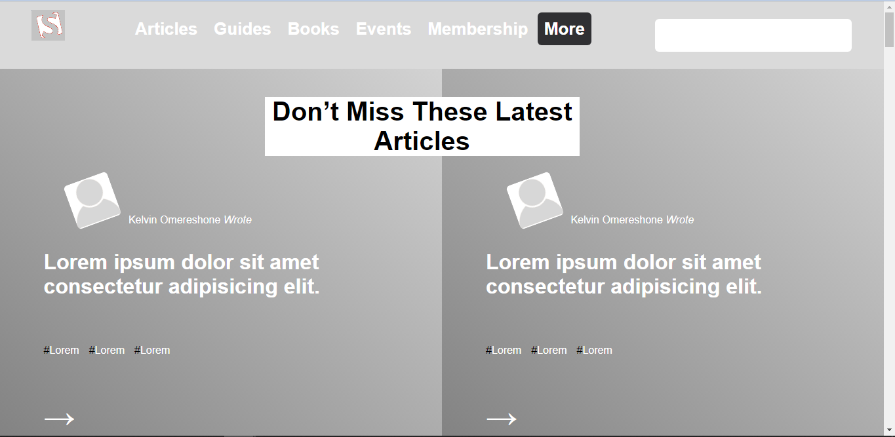

# Design Teardown
This project consists of building a heatmap of the Smashing magazine website

# Screenshot

# Live Demo
[Live Demo Link](https://lucid-dubinsky-b9958a.netlify.app/)

# Built With
* CSS
* HTML

# Authors

## Ulemu Lichapa
* Github:[@Lichapa](https://github.com/Lichapa/)
* Twitter:[@LichapaMphatso](https://twitter.com/LichapaMphatso)
* LinkedIn:[@Mphatso Lichapa](https://www.linkedin.com/in/mphatsolichapa)

## Rayan Rassam
* Github:[@Rayan84](https://github.com/Rayan84)
* Twitter:[@Rayan65096267](https://twitter.com/Rayan65096267)
* LinkedIn:[@rayan rassam](https://www.linkedin.com/in/rayan-rassam-18a0a426/)

## Contributing
Contributions, issues and feature requests are welcome!
Feel free to check the [Issue](https://github.com/Rayan84/Apple-website-webpage-clone/issues) and help me improve!